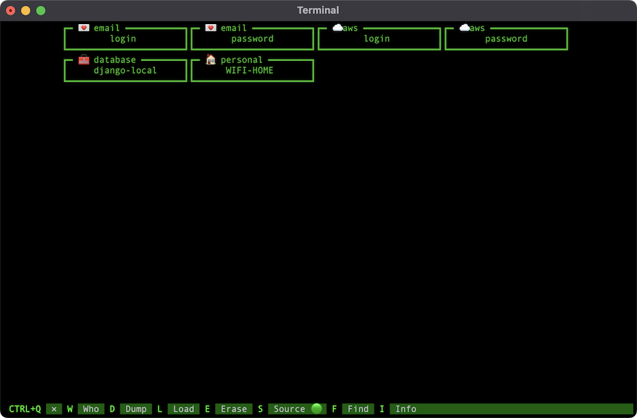
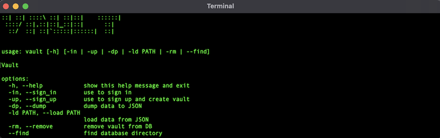
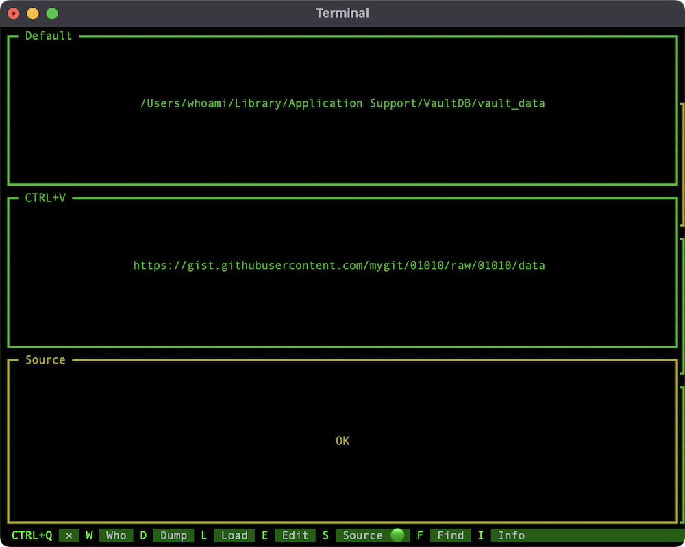
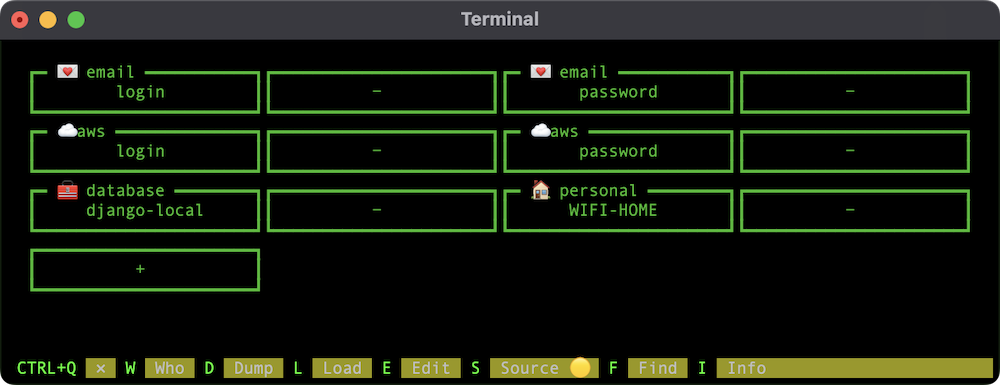
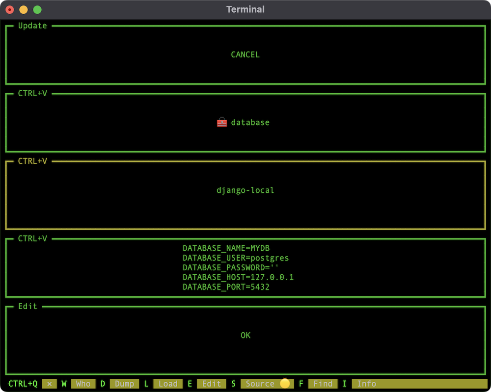

# Vault

## v1.4

Local command line password manager with an optional TUI and support for encrypted remote database sources.



### Usage

Install [Python 3.12](https://www.python.org/downloads/release/python-3120/).

#### Manual installation

```bash
curl -L https://github.com/schwarzbox/Vault/archive/master.zip --output Vault.zip
unzip Vault.zip && rm Vault.zip
cd Vault-master
python3 -m venv venv-shiv
. venv-shiv/bin/activate
pip3 install shiv
shiv -c vault -o vault --preamble preamble.py .
deactivate
rm -rf venv-shiv
```

Move `vault` to `/usr/local/bin`.

``` bash
sudo mv vault /usr/local/bin
```

#### Use install.sh

The installation script requires Bash.

``` bash
curl -L 'https://github.com/schwarzbox/Vault/archive/master.zip' --output Vault.zip
unzip Vault.zip
cd Vault-master
chmod +x install.sh
source ./install.sh
```

Verify the installation.

```bash
# show help
vault -h
# show version
vault --version
# show info
vault --info
```



#### Minimal Example

Sign up with a login and password.

```bash
vault av@example.com -up
```

Sign in with the login.

```bash
vault av@example.com -in
```

The `-in` flag can be omitted.

```bash
vault av@example.com
```

The same login can be used with a different password to create a different vault.

#### Populate Vault

Prepare JSON with your sensitive data. You can use emojis in titles.

Use the example below or `sample.json` to test the password manager.

`sample.json`
```JSON
{
    "💌 email": {
        "login": "av@example.com",
        "password": "1234"
    },
    "☁️ aws": {
        "login": "av@example.com",
        "password": "5678"
    },
    "🧰 database": {
        "django-local": "DATABASE_NAME=MYDB\nDATABASE_USER=postgres\nDATABASE_PASSWORD=''\nDATABASE_HOST=127.0.0.1\nDATABASE_PORT=5432\nDATABASE_CONN_MAX_AGE=600"
    },
    "personal": {
        "WIFI-HOME": "home"
    }
}
```

Load `sample.json` using the command line or the TUI after signing in.

```bash
vault av@example.com --load sample.json
```

Dump decrypted data from the source vault to JSON.

`--dump` writes decrypted vault data to a JSON file. Keep the file secure and remove it when it is no longer needed.

```bash
vault av@example.com --dump
```

Remove the vault from the local database.

```bash
vault av@example.com -rm
```

Find the local database directory.

```bash
vault --find
```

Internally, Vault uses the Python package `appdirs` to determine where to save the local encrypted database. On macOS, the default location is: `~/Library/Application Support/VaultDB`

#### Remote Access

Vault uses a local database by default. The `--source` option can be used to provide a different local or remote database for the current session.

Remote sources are read-only. Vault does not modify remote databases.

The source database can be stored locally or at an HTTP(S) URL.

Upload the encrypted database to GitHub or another remote location.

Load it using the `--source` option.

```bash
vault av@example.com --source 'https://raw.githubusercontent.com/MYGIT/MYREPO/main/vault_data'
```

For a private GitHub repository, provide a token with the source URL.

```bash
vault av@example.com --source 'https://raw.githubusercontent.com/MYGIT/MYREPO/main/vault_data?token=TOKEN'
```

Store the encrypted database in an unlisted gist.

```bash
vault av@example.com --source 'https://gist.githubusercontent.com/MYGIT/1234/raw/1234/vault_data'
```

The database contains encrypted data. The correct login and password are still required to decrypt the vault.

Switch to a remote source at runtime using the TUI.



#### TUI

Use the TUI to manage the vault.



Add, update, and clear data in the local vault.



#### CLI

Get data from the source vault.

```bash
vault av@example.com -g personal WIFI-HOME
```

Pipe the result to another command.

```bash
vault av@example.com -g personal WIFI-HOME | wc -c
```

List all groups and keys.

```bash
vault av@example.com -l
```

Add data to the local vault.

```bash
vault av@example.com -a personal WIFI-WORK work
```

Update a group name in the local vault.

```bash
vault av@example.com -u personal
```

The default value for the second argument is `Vault`.

```bash
vault av@example.com -u Vault private
```

Update a key name only.

```bash
vault av@example.com -u private private WIFI-WORK WIFI-OFFICE
```

Update a value using five arguments.

```bash
vault av@example.com -u private private WIFI-OFFICE WIFI-OFFICE office
```

Clear data from the local vault.

```bash
vault av@example.com -c private WIFI-OFFICE
```

Erase all data from the local vault.

```bash
vault av@example.com -e
```

### Encryption

Vault uses Fernet for authenticated symmetric encryption and Argon2id for key derivation.

The database is a JSON file containing encrypted vault identifiers and encrypted vault data.

The encryption process works as follows:

1. Vault normalizes the login using Unicode NFC normalization.
2. The normalized login is UTF-8 encoded and used as a deterministic salt for Argon2id.
3. Argon2id derives a 32-byte key from the password and login-derived salt.
4. The derived key is encoded using URL-safe Base64 and used as a Fernet key.
5. During sign-up, Vault encrypts the vault identifier using the derived Fernet key.
6. Vault encrypts every group name, key, and value before storing them in the database.
7. During sign-in, Vault derives the same key from the provided login and password.
8. Vault attempts to decrypt the vault identifiers stored in the database.
9. Sign-in succeeds when the appropriate vault identifier can be successfully decrypted.

The current key derivation uses:

```text
algorithm:    Argon2id
memory cost:  16384 KiB (16 MiB)
time cost:    3
parallelism:  4
key length:   32 bytes
salt:         normalized login encoded as UTF-8
```

### Restore Password

Vault never stores plaintext password.

There is no password-recovery mechanism. Vault cannot recover password or decrypt the encrypted vault data without the correct password.

### Credits

Design/Art/Code: [Aliaksandr Veledzimovich](https://twitter.com/veledzimovich)<br>
Engine: [Textual](https://github.com/Textualize/textual) [License](https://github.com/Textualize/textual?tab=MIT-1-ov-file)<br>
