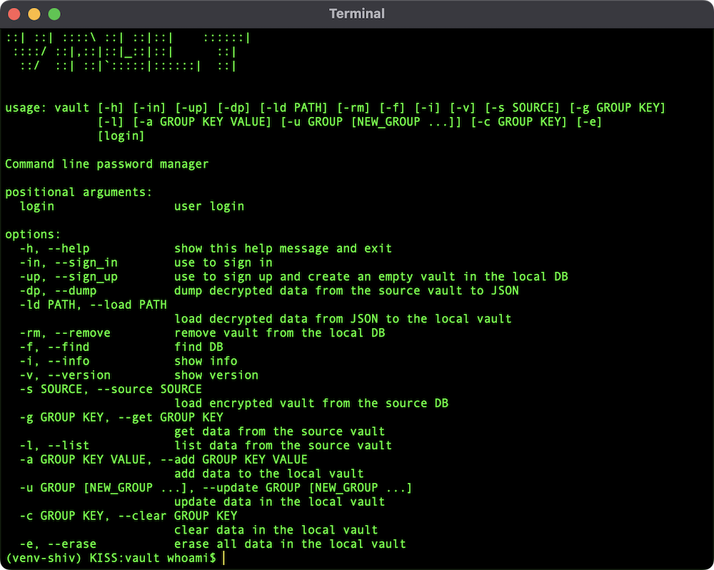

# vault

v0.8

Command line password manager.


# Install

You need python 3.9 to create executable and run <strong>vault</strong> password manager.

```bash
curl -L https://github.com/schwarzbox/Vault/archive/master.zip --output Vault.zip
unzip Vault.zip
cd Vault-master
# create virtual environment to install shiv
python3 -m venv venv-shiv
. venv-shiv/bin/activate
pip3 install shiv
# create vault executable in the current dir
shiv -c vault -o vault --preamble preamble.py .
deactivate
# remove venv-shiv
rm -rf venv-shiv
```

# Move to /usr/local/bin

You can move <strong>vault</strong> to /usr/local/bin for Mac and Linux OS.

``` bash
mv vault /usr/local/bin
```

After moving <strong>vault</strong> you can remove Vault-master and Vault.zip.

# First run

```bash
vault -h
```



```bash
# run sign-up process and enter password
vault av@myemail.com -up
# sign-in with login and password and check your empty vault
vault av@myemail.com -in
# you can omit flag -in but each action require login and password
vault av@myemail.com
```

# Prepare JSON with your sensetive data

See example below or use sample.json for testing password manager.

```JSON
{
    "email": {
        "login": "av@myemail.com",
        "password": "1234"
    },
    "aws": {
        "login": "av@myemail.com",
        "password": "5678"
    },
    "database": {
        "django-local": "DATABASE_NAME=MYDB\nDATABASE_USER=postgres\nDATABASE_PASSWORD=''\nDATABASE_HOST=127.0.0.1\nDATABASE_PORT=5432\nDATABASE_CONN_MAX_AGE=600"
    },
    "personal": {
        "WIFI-HOME": "wifi-av"
    }
}
```

Load sample.json using command line or use TUI after sign-in.

```bash
vault av@myemail.com --load sample.json
```

# Encryption

Vault use SHA256 algorithm.

1. When user sign-up app creates <strong>safe key</strong> using login and password.
2. App combine login and password in one <strong>credential string</strong>.
3. App uses <strong>safe key</strong> to encode <strong>credential string</strong> and get <strong>user token</strong>.
4. <strong>User token</strong> uses as unique key for the user vault.
5. All data in the user vault encrypted using <strong>safe key</strong>.
6. When user sign-in app creates new safe key from provided login and password.
7. App tries to decode each <strong>user token</strong> in database and compare with provided login and password.
8. User successfully sign-in when provided login and password mathes with decoded data from <strong>user token</strong>.

Note: User can use same login with different passwords.

# Restore password and decode data

Vault never save your decrypted password. Still no way to restore it and decode ecrypted data without password.

# Remove vault

```bash
vault av@myemail.com -rm
```

# Database location

Iternally <strong>Vault</strong> use python package <strong>appdirs</strong> to determine where to save encrypted database. For MacOS it is "~/Library/Application Support/VaultDB".

```bash
vault --find
```

# Version

```bash
vault --version
```

# Road map

v0.9 TUI authentication if needed
v1.0 change vaultDB path & provide access to vault_data.db by http
