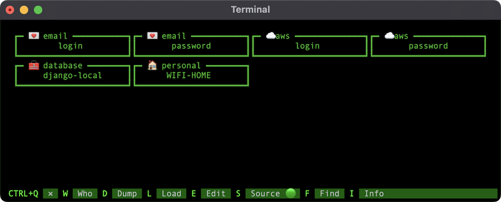

# vault

v0.5

Command line password manager.



# Installation or [pre-build app](https://github.com/schwarzbox/Vault/releases)

You need python3 to create executable and run vault password manager.

```bash
curl -L https://github.com/schwarzbox/Vault/archive/master.zip --output Vault.zip
unzip Vault.zip
cd Vault-master
# create virtual environment to install shiv
python3 -m venv venv-shiv
. venv-shiv/bin/activate
pip3 install shiv
# create executable in the current dir
shiv -c vault -o vault --preamble preamble.py .
deactivate
# remove venv-shiv
rm -rf venv-shiv
```

# Move to /usr/local/bin

You can move <strong>vault</strong> to /usr/local/bin for Mac and Linux OS.

``` bash
mv vault /usr/local/bin
```

After moving files you can remove Vault-master and Vault.zip.

# First run

```bash
# run vault help
vault -h
```


```bash
# sign-up and create empty vault
vault av@gmail.com Vault-96 -up
# sign-in and check that vault is empty
vault av@gmail.com Vault-96 -in
# load data from json to vault and auto sign-in
vault av@gmail.com Vault-96 -ld <your.json>
```

# Prepare JSON with your sensetive data
```JSON
{
    "gmail": {
        "login": "av@gmail.com",
        "password": "1234"
    },
    "database": {
        "django-local": "DATABASE_NAME=DB\nDATABASE_USER=postgres\nDATABASE_PASSWORD=''\nDATABASE_HOST=127.0.0.1\nDATABASE_PORT=5432\nDATABASE_CONN_MAX_AGE=600",
        "django-testing": "DATABASE_NAME=DB\nDATABASE_USER=postgres\nDATABASE_PASSWORD=''\nDATABASE_HOST=127.0.0.1\nDATABASE_PORT=5432\nDATABASE_CONN_MAX_AGE=600"
    },
    "aws": {
        "login": "av@gmail.com",
        "password": "1234567"
    },
    "jenkins": {
        "login": "av",
        "password": "12345"
    },
    "personal": {
        "Pro Bank Account": "12345678901234567",
        "WIFI-HOME": "1234"
    }
}
```

# Database location

Iternally <strong>vault</strong> use python package <strong>appdirs</strong> to determine where to save encrypted database. For MacOS it is "/Users/whoami/Library/Application Support/VaultDB" dir.

```bash
# get VaultDB location
vault av@gmail.com Vault-96 --locate
```

# Next releases

v0.6 show --locate in TUI

v0.7 reset password with email or with CLI

v1.0 TUI authentication & TUI --load
