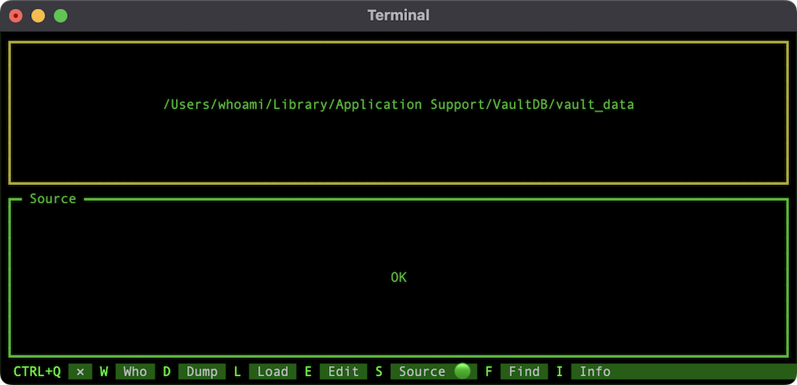

# vault

v1.15

Command line password manager.


# Install

You need python 3.9 to create executable and run <strong>vault</strong> password manager.

```bash
curl -L https://github.com/schwarzbox/Vault/archive/master.zip --output Vault.zip
unzip Vault.zip
cd Vault-master
# create virtual environment to install shiv
python3 -m venv venv-shiv
. venv-shiv/bin/activate
pip3 install shiv
# create vault executable in the current dir
shiv -c vault -o vault --preamble preamble.py . --use-feature=in-tree-build
deactivate
# remove venv-shiv
rm -rf venv-shiv
```

# First run

```bash
./vault -h
```


```bash
# enter login and run sign up process
./vault av@myemail.com -up
```

# Prepare JSON with your sensetive data

See example below or use sample.json for testing password manager.

```JSON
{
    "email": {
        "login": "av@myemail.com",
        "password": "1234"
    },
    "aws": {
        "login": "av@myemail.com",
        "password": "5678"
    },
    "database": {
        "django-local": "DATABASE_NAME=MYDB\nDATABASE_USER=postgres\nDATABASE_PASSWORD=''\nDATABASE_HOST=127.0.0.1\nDATABASE_PORT=5432\nDATABASE_CONN_MAX_AGE=600"
    },
    "personal": {
        "WIFI-HOME": "wifi-av"
    }
}
```

Load sample.json using command line or use TUI after sign in.

```bash
./vault av@myemail.com --load sample.json
```

# Move to /usr/local/bin

You can move <strong>vault</strong> to /usr/local/bin for Mac and Linux OS.

``` bash
mv vault /usr/local/bin
```

After moving <strong>vault</strong> you can remove Vault-master and Vault.zip.

Now you can use <strong>vault</strong> as usual.

```bash
# sign-in with login
vault av@myemail.com -in
# you can omit flag -in
vault av@myemail.com
```

# Encryption

Vault use SHA256 algorithm. Database is a simple JSON file.

1. When user sign-up app creates <strong>safe key</strong> using login and password.
2. App combine login and password in one <strong>credential string</strong>.
3. App uses <strong>safe key</strong> to encode <strong>credential string</strong> and get <strong>user token</strong>.
4. <strong>User token</strong> uses as unique key for the user vault.
5. All data in the user vault encrypted using <strong>safe key</strong>.
6. When user sign-in app creates new safe key from provided login and password.
7. App tries to decode each <strong>user token</strong> in database and compare with provided login and password.
8. User successfully sign in when provided login and password matches with decoded data from <strong>user token</strong>.

# Restore password and decode data

Vault never save your decrypted password. Still no way to restore it and decode ecrypted data without password.

# Remote access

<strong>Vault</strong> creates default database and --source flag by set to None. You can provide temporary remote or local source for current session.

Upload encrypted database in GitHub or anywere else.

Load vault from database in github repo. It is safe if you upload encrypted data from your local database.

```bash
vault av@myemail.com --source 'https://raw.githubusercontent.com/MYGIT/MYREPO/main/vault_data'
```

Load vault from database in private github repo. You need to provide token. But this token expired and you need to generate new link.

```bash
vault av@myemail.com --source 'https://raw.githubusercontent.com/MYGIT/MYREPO/main/vault_data?token=TOKEN'
```

You can create secret gist and load encrypted database.

```bash
vault av@myemail.com --source 'https://gist.githubusercontent.com/MYGIT/1234/raw/1234/vault_data'
```

You can switch to remote source at runtime using TUI.



# Erase data in local vault

```bash
vault av@myemail.com -er
```

# Remove vault from local database

```bash
vault av@myemail.com -rm
```

# Find local database dir

Iternally <strong>Vault</strong> use python package <strong>appdirs</strong> to determine where to save local encrypted database. For MacOS it is "~/Library/Application Support/VaultDB".

```bash
vault --find
```

# About

```bash
vault --about
```

# Version

```bash
vault --version
```

# Road Map

v1.2

- TUI CRUD
- pipes

